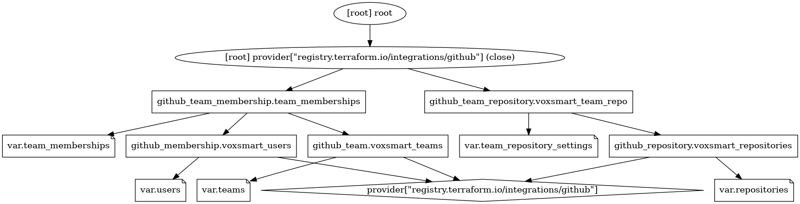

# NOTE:
During the resolution of the exercise my laptop froze and I got a problem with WSL  and also with my terraform state, but I could manage to to it under 90 min, not without much pressure. I have created a commit where I thought I had finished in time, since everything was working, it was done under 90 min. I didn't try to recreate everything from scratch, and when I did it I realized that I was missing the dependencies among terraform resources, that's why I created another commit with the depend_on keyword, where I also changed the GitHub user to a new created one to test the invitation to my teams. After finishing the exercise I decided to add more code and functionality to show how I would create the project if I could decide (again, in a push way, not with ArgoCD, since that would have been too much)

# Assumptions
- Testing: not sure which approach is used with infrastructure in the current team, so I didn't do it. Usually, I don't test terraform code.
- No need to create a DEV organization nor DEV environent on GitHub.
- Not using GitOps: Otherwise, I would use ArgoCD with Crossplane in order to run terraform commands.
- A user belongs to only one team.
- No need to create new users.
- We can store our state in Europe.
- We protect the main branch.
- In order to develop the pipeline, we create a dev branch to simulate the push on main.
- Architecture diagram can be created automatically on merging into main, current tool is very rudimentary.

# Security

## Least Privilege:
- GitHub Token with the least privileges according to the documentation.
- AWS terraform's technical user is used to store the state file.
- Terraform state file is locked with a DynamoDB table.
- Trivy is running to scan for vulnerabilities: As some vulnerabilities were found, it is just omitting the output.

# Architecture

